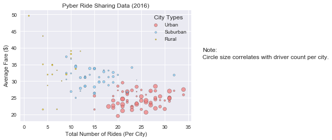
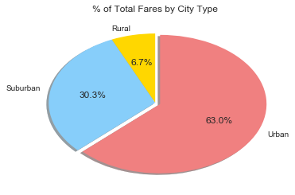
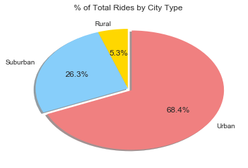
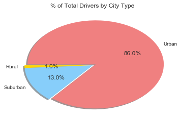

```python
import pandas as pd
import matplotlib.pyplot as plt
import seaborn
citypath = 'Resources/city_data.csv'
ridepath = 'Resources/ride_data.csv'
city_csv = pd.read_csv(citypath)
ride_csv = pd.read_csv(ridepath)
city_ride_data = pd.merge(ride_csv, city_csv, how='left', on='city')
city_ride_data.head()
```


<div>
<style>
    .dataframe thead tr:only-child th {
        text-align: right;
    }

    .dataframe thead th {
        text-align: left;
    }

    .dataframe tbody tr th {
        vertical-align: top;
    }
</style>
<table border="1" class="dataframe">
  <thead>
    <tr style="text-align: right;">
      <th></th>
      <th>city</th>
      <th>date</th>
      <th>fare</th>
      <th>ride_id</th>
      <th>driver_count</th>
      <th>type</th>
    </tr>
  </thead>
  <tbody>
    <tr>
      <th>0</th>
      <td>Sarabury</td>
      <td>2016-01-16 13:49:27</td>
      <td>38.35</td>
      <td>5403689035038</td>
      <td>46</td>
      <td>Urban</td>
    </tr>
    <tr>
      <th>1</th>
      <td>South Roy</td>
      <td>2016-01-02 18:42:34</td>
      <td>17.49</td>
      <td>4036272335942</td>
      <td>35</td>
      <td>Urban</td>
    </tr>
    <tr>
      <th>2</th>
      <td>Wiseborough</td>
      <td>2016-01-21 17:35:29</td>
      <td>44.18</td>
      <td>3645042422587</td>
      <td>55</td>
      <td>Urban</td>
    </tr>
    <tr>
      <th>3</th>
      <td>Spencertown</td>
      <td>2016-07-31 14:53:22</td>
      <td>6.87</td>
      <td>2242596575892</td>
      <td>68</td>
      <td>Urban</td>
    </tr>
    <tr>
      <th>4</th>
      <td>Nguyenbury</td>
      <td>2016-07-09 04:42:44</td>
      <td>6.28</td>
      <td>1543057793673</td>
      <td>8</td>
      <td>Urban</td>
    </tr>
  </tbody>
</table>
</div>


```python
average_fares = city_ride_data.groupby("city").mean()[["fare"]]
average_fares = average_fares.rename(columns={"fare": "Average Fare ($) Per City"})
total_rides = city_ride_data.groupby("city").count()[["ride_id"]]
total_rides = total_rides.rename(columns={"ride_id": "Total Number of Rides Per City"})
total_rides = average_fares.join(total_rides)
total_rides = pd.merge(total_rides, city_csv, left_index=True, right_on='city')
total_rides = total_rides.rename(columns={"driver_count": "Total Number of Drivers Per City", "type": "City Type","city": "City"})
total_rides_urban = total_rides.loc[total_rides['City Type'] == "Urban"]
total_rides_suburban = total_rides.loc[total_rides['City Type'] == "Suburban"]
total_rides_rural = total_rides.loc[total_rides['City Type'] == "Rural"]
```


```python
print("Bubble Plot of Ride Sharing Data")
seaborn.set()
plt.scatter(total_rides_urban["Total Number of Rides Per City"], total_rides_urban["Average Fare ($) Per City"], label="Urban", c="lightcoral", edgecolors="black", alpha=0.75, s=total_rides_urban["Total Number of Drivers Per City"])
plt.scatter(total_rides_suburban["Total Number of Rides Per City"], total_rides_suburban["Average Fare ($) Per City"], label="Suburban", c="lightskyblue", edgecolors="black", alpha=0.75, s=total_rides_suburban["Total Number of Drivers Per City"])
plt.scatter(total_rides_rural["Total Number of Rides Per City"], total_rides_rural["Average Fare ($) Per City"], label="Rural", c="gold", edgecolors="black", alpha=0.75, s=total_rides_rural["Total Number of Drivers Per City"])
plt.title("Pyber Ride Sharing Data (2016)")
plt.xlabel("Total Number of Rides (Per City)")
plt.ylabel("Average Fare ($)")
plt.legend(title="City Types")
plt.figtext(.95, 0.6, "Note:")
plt.figtext(.95, 0.55, "Circle size correlates with driver count per city.")
plt.show()
```

    Bubble Plot of Ride Sharing Data
    





```python
colors = ["gold", "lightskyblue", "lightcoral"]
explode = (0, 0, 0.05)
total_fares = city_ride_data.groupby("type").sum()
print("Total Fares by City Type")
plt.title("% of Total Fares by City Type")
plt.pie(total_fares["fare"], explode=explode, labels=total_fares.index, colors=colors, autopct="%1.1f%%", shadow=True, startangle=90)
plt.show()
```

    Total Fares by City Type
    





```python
colors = ["gold", "lightskyblue", "lightcoral"]
explode = (0, 0, 0.05)
total_city_rides = city_ride_data.groupby("type").count()
print("Total Rides by City Type")
plt.title("% of Total Rides by City Type")
plt.pie(total_city_rides["ride_id"], explode=explode, labels=total_city_rides.index, colors=colors, autopct="%1.1f%%", shadow=True, startangle=90)
plt.show()
```

    Total Rides by City Type
    





```python
colors = ["gold", "lightskyblue", "lightcoral"]
explode = (0, 0, 0.05)
total_city_drivers = city_ride_data.groupby("type").sum()
print("Total Drivers by City Type")
plt.title("% of Total Drivers by City Type")
plt.pie(total_city_drivers["driver_count"], explode=explode, labels=total_city_drivers.index, colors=colors, autopct="%1.1f%%", shadow=True, startangle=180)
plt.show()
```

    Total Drivers by City Type
    




